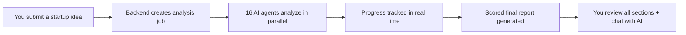

# AI Startup Analyzer

<div align="center">

[](https://github.com/Abbaddii-99/AI-Startup-Analyzer/actions/workflows/ci.yml)
[](https://github.com/Abbaddii-99/AI-Startup-Analyzer/security/code-scanning)
[](LICENSE)
[](#repository-structure)

**AI-powered startup idea analysis platform.** Submit an idea, get a comprehensive multi-section report with scores, market insights, MVP plans, and go-to-market strategies — all generated by specialized AI agents.

</div>

---

## What You Get

Enter a startup idea and receive a **full analysis report** covering:

| Section | What It Covers |
|---------|---------------|
| 💡 **Summary & Scoring** | Overall score (1–10) across market demand, competition, execution difficulty, and profit potential |
| 🎯 **Idea Validation** | Problem-solution fit, market potential, feasibility, and key risks |
| 👥 **Target Audience** | Customer segments, personas, and early adopter profiles |
| 📊 **Market Research** | TAM/SAM/SOM sizing, growth trends, and geographic opportunities |
| ⚔️ **Competitor Analysis** | Direct/indirect competitors with strengths, weaknesses, and pricing |
| 🚀 **MVP Plan** | Core features, KPIs, technical milestones, and complexity assessment |
| 💰 **Monetization Strategy** | Revenue models, pricing tiers, and unit economics |
| 📣 **Go-To-Market** | Marketing channels, growth hacks, community strategies, and partnerships |
| 🗺️ **Roadmap** | 4-phase project plan with milestones, tasks, and deliverables |
| ⚠️ **Risk Assessment** | Top risks with probability, impact scores, and mitigation strategies |
| 🏢 **Business Model** | Pattern matching against 43 proven business models |
| 🎨 **Brand Identity** | Name ideas, taglines, color palette, typography, and logo direction |
| 🌟 **Vision & Mission** | Vision statement, mission, core values, UVP, and elevator pitch |
| 💵 **Budget Estimator** | Category breakdown, revenue projections, runway, and break-even analysis |

### Example Workflow

```
You type: "An AI tool that turns meeting recordings into searchable,
           action-item-tagged notes with auto-assigned owners"

↓ 16 AI agents analyze your idea in parallel (60–120 seconds)

You get: A scored report with market size, 5 competitors, MVP feature
         list, pricing suggestions, 4-phase roadmap, risk matrix,
         brand palette, and go-to-market plan.
```

## Live Demo Flow



## Screenshots

> **Note:** Screenshots below are placeholders. Replace with real captures:
> ```bash
> # Replace these files with actual screenshots/GIFs:
> # assets/readme/dashboard.png
> # assets/readme/analysis-progress.png
> # assets/readme/final-report.png
> # assets/readme/demo.gif
> ```


## Key Features

- **16 specialized AI agents** working in parallel for comprehensive analysis
- **Real-time progress tracking** — watch each agent complete its section
- **Scored reports** — quantitative scoring for easy comparison
- **AI chat assistant** — ask follow-up questions about your analysis
- **PDF export** — download your report as a shareable PDF
- **Regenerate sections** — re-run any section with one click
- **JWT auth** with Google OAuth support
- **Plan tiers** — FREE (3/mo), PRO (50/mo), TEAM (999/mo)
- **Security-first** — helmet headers, CSRF protection, rate limiting, bcrypt passwords

---

# 🛠️ Developer Guide

## Architecture

```
┌─────────────────────────────────────────────────────┐
│                    Frontend (Next.js 16)             │
│  Dashboard ─ Analysis Viewer ─ Auth ─ Report Sections│
└──────────────────────┬──────────────────────────────┘
                       │ HTTPS (axios + cookies)
┌──────────────────────▼──────────────────────────────┐
│                    Backend (NestJS 10)               │
│  Auth ─ Analysis API ─ Chat ─ Rate Limiting          │
└───────┬──────────────────────────────┬───────────────┘
        │                              │
┌───────▼───────┐          ┌───────────▼───────────────┐
│   PostgreSQL   │          │     Redis + BullMQ        │
│  (or SQLite)   │          │  Queue: 16 AI agents       │
│   Prisma ORM   │          │  Jobs: analyze, retry      │
└───────────────┘          └───────────┬───────────────┘
                                       │
                            ┌──────────▼───────────────┐
                            │     AI Providers          │
                            │  Google Gemini 2.0 Flash   │
                            │  OpenRouter (GPT-4o-mini) │
                            │  Redis cache (24h TTL)    │
                            └──────────────────────────┘
```

### Agent Pipeline

```
Phase 1 — Parallel Core Agents (Promise.all)
  ├── IdeaAnalyzer        → validation, feasibility, risks, score
  ├── MarketResearch      → TAM/SAM/SOM, growth trends
  ├── CompetitorAnalysis  → competitors with strengths/weaknesses
  ├── MVPGenerator        → features, KPIs, milestones
  ├── Monetization        → revenue models, pricing tiers
  └── GoToMarket          → channels, growth hacks, partnerships

Phase 2 — Parallel Advanced Agents (Promise.allSettled)
  ├── FinalReport         → combined report with retry/repair + grounding
  ├── RiskRadar           → risks with probability, impact, mitigation
  ├── Roadmap             → 4-phase project plan
  ├── BusinessModel       → 43 model pattern matching
  ├── VisionMission       → vision, mission, values, elevator pitch
  ├── BrandIdentity       → names, colors, typography, logo direction
  └── BudgetEstimator     → budget, revenue projections, break-even

Phase 3 — Sequential
  └── ComprehensiveIdeaAnalyzer  → final viability assessment
```

## Tech Stack

| Layer | Technology |
|-------|-----------|
| **Package Manager** | pnpm 10 + Turborepo |
| **Frontend** | Next.js 16, React 19, TypeScript, Tailwind CSS, Recharts |
| **Backend** | NestJS 10, TypeScript, Passport JWT + Google OAuth |
| **Queue** | BullMQ 5 + ioredis |
| **Database** | Prisma 5 — SQLite (dev) / PostgreSQL (prod) |
| **AI** | Google Gemini 2.0 Flash, OpenRouter (GPT-4o-mini) |
| **CI/CD** | GitHub Actions |
| **Deployment** | Docker Compose (prod), Netlify (frontend) |

## Repository Structure

```text
AI-Startup-Analyzer/
├── apps/
│   ├── backend/          # NestJS API + queue workers + 16 AI agents
│   └── frontend/         # Next.js 16 web app
├── packages/
│   ├── db/               # Prisma schema + database package
│   └── shared/           # Shared types, validation, normalization
├── scripts/              # Housekeeping utilities
├── docker-compose.yml    # Dev: PostgreSQL + Redis
├── docker-compose.prod.yml  # Production deployment
└── netlify.toml          # Frontend-only deploy config
```

## Quick Start

### Prerequisites

| Requirement | Version |
|-------------|---------|
| Node.js | 20+ |
| pnpm | 10+ |
| Redis | 7+ (Docker recommended) |
| AI API key | Gemini or OpenRouter |

### 1. Install dependencies

```bash
pnpm install
```

### 2. Configure environment

```bash
cp .env.example .env
```

Edit `.env` and set at minimum:

```env
# AI (at least one)
GEMINI_API_KEY=your-key-here
# or
OPENROUTER_API_KEY=your-key-here

# Auth
JWT_SECRET=generate-a-strong-random-string-here

# Database
DATABASE_URL="file:./packages/db/prisma/dev.db"
DB_PROVIDER="sqlite"

# Redis (if using Docker Redis)
REDIS_HOST=localhost
REDIS_PORT=6379
```

### 3. Start Redis (Docker)

```bash
docker run --name ai-analyzer-redis -p 6379:6379 -d redis:7-alpine
```

### 4. Prepare database

```bash
pnpm db:generate
pnpm db:push
```

### 5. Run the app

```bash
pnpm dev
```

- **Frontend:** http://localhost:3000
- **Backend API:** http://localhost:4000

## Common Commands

```bash
pnpm dev              # Start both frontend + backend
pnpm build            # Build all packages
pnpm lint             # ESLint across workspace
pnpm test             # Run test suites
pnpm db:generate      # Generate Prisma client
pnpm db:push          # Push schema to database
pnpm db:studio        # Open Prisma Studio GUI
```

## Production Deployment

### Docker Compose (recommended)

```bash
# Set up production .env file first:
cp .env.example .env.prod
# Edit .env.prod with production values:
#   - JWT_SECRET (strong random string)
#   - DATABASE_URL (PostgreSQL connection)
#   - DB_PROVIDER=postgresql
#   - GEMINI_API_KEY / OPENROUTER_API_KEY
#   - FRONTEND_URL (your production URL)
#   - GOOGLE_CLIENT_ID / GOOGLE_CLIENT_SECRET (optional)

docker compose -f docker-compose.prod.yml up -d
```

This starts:
- PostgreSQL 16 (persistent volume)
- Redis 7 (persistent volume)
- Backend (port 4000, health checked)
- Frontend (port 3000)

All services auto-restart and include health checks.

### Netlify (frontend only)

The repo includes `netlify.toml` for deploying just the frontend:

- **Build command:** `pnpm --filter @ai-analyzer/frontend build`
- **Publish directory:** `apps/frontend/.next`
- **Required env var:** `NEXT_PUBLIC_API_URL` → your backend URL

### Environment Variables Reference

| Variable | Required | Default | Description |
|----------|----------|---------|-------------|
| `DATABASE_URL` | ✅ | — | Connection string (SQLite file path or PostgreSQL URL) |
| `DB_PROVIDER` | ✅ | `sqlite` | `sqlite` or `postgresql` |
| `GEMINI_API_KEY` | One of | — | Google Gemini API key |
| `OPENROUTER_API_KEY` | One of | — | OpenRouter API key |
| `JWT_SECRET` | ✅ | — | Strong random string for JWT signing |
| `JWT_EXPIRES_IN` | | `7d` | JWT access token expiry |
| `REDIS_HOST` | | `localhost` | Redis server hostname |
| `REDIS_PORT` | | `6379` | Redis server port |
| `REDIS_PASSWORD` | | — | Redis password (if any) |
| `FRONTEND_URL` | | `http://localhost:3000` | Frontend URL (for CORS) |
| `BACKEND_PORT` | | `4000` | Backend server port |
| `GOOGLE_CLIENT_ID` | | — | Google OAuth client ID |
| `GOOGLE_CLIENT_SECRET` | | — | Google OAuth client secret |
| `GOOGLE_CALLBACK_URL` | | `http://localhost:4000/auth/google/callback` | OAuth callback URL |
| `ENABLE_AI_GROUNDING` | | `true` | Enable AI-based report grounding |
| `ENABLE_RULE_GROUNDING` | | `true` | Enable rule-based report grounding |

## API Reference

### Authentication

| Method | Endpoint | Auth | Description |
|--------|----------|------|-------------|
| POST | `/auth/register` | ❌ | Register with email + password (throttled: 5/min) |
| POST | `/auth/login` | ❌ | Login (throttled: 10/min) |
| POST | `/auth/refresh` | ❌ | Refresh access token |
| POST | `/auth/logout` | ❌ | Invalidate refresh token |
| GET | `/auth/google` | ❌ | Initiate Google OAuth |
| GET | `/auth/google/callback` | ❌ | OAuth callback |
| GET | `/auth/me` | ✅ | Get current user profile |

### Analysis (all require JWT via httpOnly cookie)

| Method | Endpoint | Description |
|--------|----------|-------------|
| POST | `/analysis` | Create new analysis (idea string, max 2000 chars) |
| GET | `/analysis` | Get all user analyses (paginated: `?skip=0&take=20`) |
| GET | `/analysis/:id` | Get single analysis |
| GET | `/analysis/:id/progress` | Poll analysis progress |
| DELETE | `/analysis/:id` | Delete analysis |
| POST | `/analysis/:id/retry` | Retry failed analysis |
| POST | `/analysis/:id/regenerate/:section` | Regenerate specific section |
| POST | `/analysis/chat` | Chat with AI about analysis (throttled: 10/min) |
| GET | `/analysis/csrf-token` | Get CSRF token for state-changing requests |
| GET | `/analysis/me/plan` | Get user plan info (FREE/PRO/TEAM limits) |
| GET | `/health` | Health check (no auth) |

## Security Features

| Feature | Implementation |
|---------|---------------|
| **Password hashing** | bcrypt (12 rounds) |
| **Password strength** | 10+ chars, uppercase, lowercase, number, special character |
| **JWT auth** | httpOnly, secure, SameSite cookies |
| **CSRF protection** | Double Submit Cookie pattern on all state-changing requests |
| **Rate limiting** | Throttler on login (10/min), register (5/min), chat (10/min) |
| **CORS** | Restricted to configured `FRONTEND_URL` in production |
| **Security headers** | Helmet (HSTS, X-Frame-Options, CSP, X-Content-Type-Options, etc.) |
| **Body size limit** | JSON payloads capped at 1MB |
| **Input sanitization** | HTML/injection patterns stripped from user input |
| **Refresh token rotation** | 30-day expiry with single-use rotation |

## Contributing

1. Fork the repository
2. Create a feature branch (`git checkout -b feature/amazing-feature`)
3. Commit your changes (`git commit -m 'feat: add amazing feature'`)
4. Push to the branch (`git push origin feature/amazing-feature`)
5. Open a Pull Request

### Code style

- ESLint + Prettier enforced
- TypeScript strict mode
- Conventional commits preferred

### Adding a new AI agent

1. Create agent file in `apps/backend/src/agents/your-agent.agent.ts`
2. Implement `Agent<T>` interface
3. Register in `AgentsModule` (add to `AGENTS` array)
4. Add to `AnalysisProcessor` pipeline
5. Add result field to `Analysis` model in `packages/db/prisma/schema.prisma`
6. Run `pnpm db:generate && pnpm db:push`

## Troubleshooting

### Analysis stuck in "Pending"

- Ensure Redis is running and reachable (`REDIS_HOST`, `REDIS_PORT`)
- Check backend logs for queue connection errors

### CI failing at `pnpm install`

- Lockfile may be out of sync. Run `pnpm install` locally and push the updated `pnpm-lock.yaml`

### Prisma errors after schema changes

```bash
pnpm db:generate
pnpm db:push
```

### Google OAuth not working

- Set `GOOGLE_CLIENT_ID`, `GOOGLE_CLIENT_SECRET`, and `GOOGLE_CALLBACK_URL` in `.env`
- Callback URL in Google Cloud Console must match `GOOGLE_CALLBACK_URL`

## License

[MIT](LICENSE)
