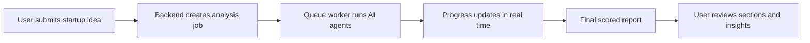
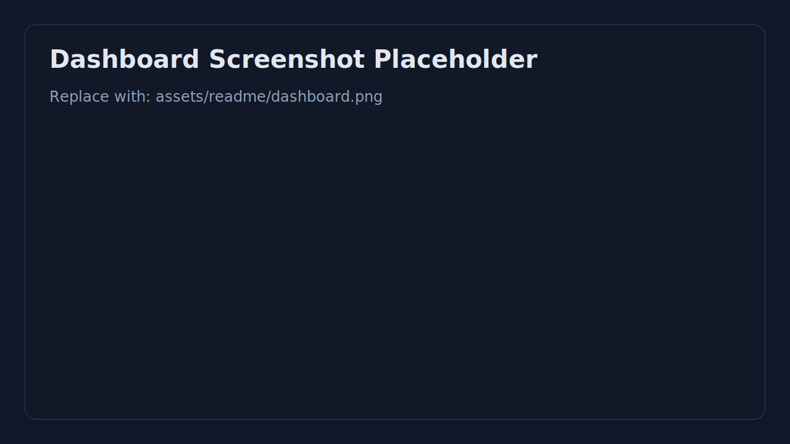
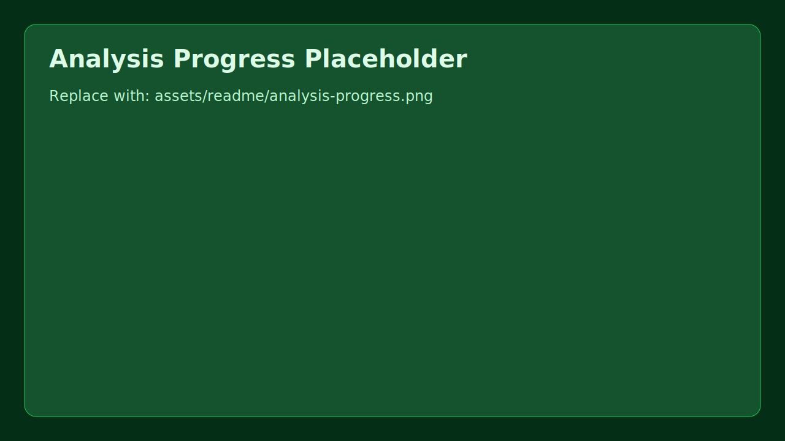
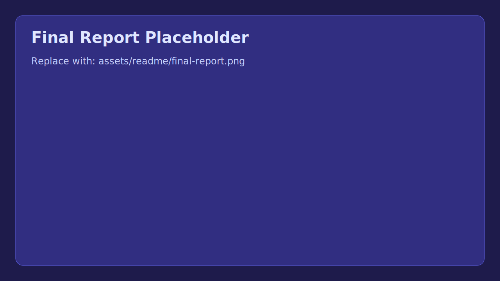
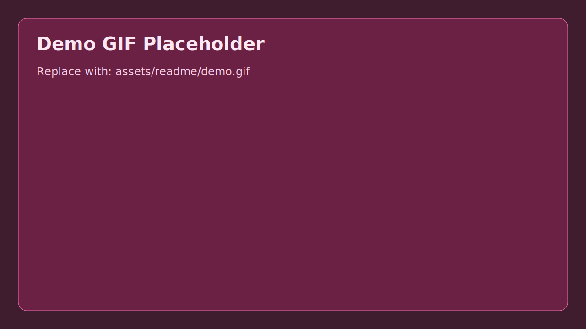

# AI Startup Analyzer

<div align="center">

[](https://github.com/Abbaddii-99/AI-Startup-Analyzer/actions/workflows/ci.yml)
[](https://github.com/Abbaddii-99/AI-Startup-Analyzer/security/code-scanning)
[](https://github.com/Abbaddii-99/AI-Startup-Analyzer/security/dependabot)
[](LICENSE)
[](#repository-structure)
[](#tech-stack)
[](#tech-stack)
[](#tech-stack)

AI-powered startup idea analysis platform with a multi-agent pipeline.

</div>

## Product Demo Flow



## Screenshots and GIF






Placeholder files are included under `assets/readme/`.

When you're ready, replace them with real captures:
- `assets/readme/dashboard.png`
- `assets/readme/analysis-progress.png`
- `assets/readme/final-report.png`
- `assets/readme/demo.gif`

Then update image references:

```md


```

## Why This Project

AI Startup Analyzer helps founders evaluate ideas faster by combining specialized AI analysis stages into one workflow:
- Idea validation
- Market and competitor understanding
- MVP and monetization direction
- Go-to-market and report scoring

It is built as a production-oriented monorepo with separate frontend, backend, and shared packages.

## Key Features

- Multi-agent analysis pipeline orchestrated in backend jobs
- Authenticated user workflows (JWT)
- Async processing with progress tracking (Redis + BullMQ)
- Structured final report with scoring fields
- Monorepo developer experience with `pnpm` + Turborepo

## Tech Stack

- Frontend: Next.js 16, React 19, TypeScript, Tailwind CSS
- Backend: NestJS 10, TypeScript, Passport JWT
- Queue: Redis, BullMQ
- Database: Prisma ORM (SQLite by default in current config)
- AI Providers: Google Gemini API, OpenRouter
- CI/CD: GitHub Actions

## Repository Structure

```text
apps/
  backend/      NestJS API + queue workers
  frontend/     Next.js web app
packages/
  db/           Prisma schema + DB package
  shared/       Shared types/utilities
```

## Quick Start

### 1) Prerequisites

- Node.js 18+
- pnpm 8+
- Redis (required for queue processing)

### 2) Install

```bash
pnpm install
```

### 3) Configure environment

```bash
cp .env.example .env
```

Minimum required values in `.env`:
- `GEMINI_API_KEY` or `OPENROUTER_API_KEY`
- `JWT_SECRET`
- `DATABASE_URL`
- `REDIS_HOST`, `REDIS_PORT`

### 4) Start Redis

Example with Docker:

```bash
docker run --name ai-analyzer-redis -p 6379:6379 -d redis:7-alpine
```

### 5) Prepare DB

```bash
pnpm db:generate
pnpm --filter @ai-analyzer/db run push
```

### 6) Run the app

```bash
pnpm dev
```

Open:
- Frontend: http://localhost:3000
- Backend: http://localhost:4000

## Common Commands

```bash
pnpm dev
pnpm build
pnpm lint
pnpm test
pnpm db:generate
pnpm db:migrate
pnpm db:studio
```

## Netlify Deployment

The repository ships with a `netlify.toml` so Netlify will only build the frontend app instead of the entire workspace. Use these settings on your Netlify site:

- **Base directory:** the root of the repo (default)
- **Build command:** `pnpm --filter @ai-analyzer/frontend build`
- **Publish directory:** `apps/frontend/.next`

Make sure `NEXT_PUBLIC_API_URL` (and any other `NEXT_PUBLIC_*` environment variables your frontend relies on) point at your running backend API so the client can submit ideas and poll for progress.

## API (High-level)

Auth:
- `POST /auth/register`
- `POST /auth/login`

Analysis:
- `POST /analysis`
- `GET /analysis`
- `GET /analysis/:id`
- `GET /analysis/:id/progress`

## Notes

- `docker-compose.yml` currently defines PostgreSQL and Redis services.
- Prisma datasource in the current codebase is configured to SQLite by default.
- If switching to PostgreSQL, update Prisma datasource and `DATABASE_URL` accordingly.

## Security

The project uses dependency and code scanning in GitHub. Keep dependencies updated and review CI/security alerts regularly.

## FAQ

### Why does CI fail at `pnpm test` with \"No tests found\"?

Backend currently allows empty test suites with `jest --passWithNoTests`, so CI should pass. If it fails, verify your latest `apps/backend/package.json` is pushed.

### Why do I see warnings about Node.js 20 deprecation in GitHub Actions?

GitHub actions are migrating JS actions runtime to Node 24. The workflow is already configured to opt into Node 24 actions runtime.

### Why does README mention SQLite while `docker-compose.yml` has PostgreSQL?

Current Prisma datasource defaults to SQLite in code. Docker compose includes PostgreSQL for teams that want to switch. Keep them aligned before deployment.

### Dependabot alerts are still open after upgrades. Is that normal?

Yes, alerts may take a few minutes to refresh after pushing lockfile updates. Re-run workflow and refresh Security tab.

### I started the app but analysis is stuck in pending.

Check Redis is running and reachable by backend (`REDIS_HOST`, `REDIS_PORT`). Queue workers depend on Redis.

## License

MIT. See [LICENSE](LICENSE).
